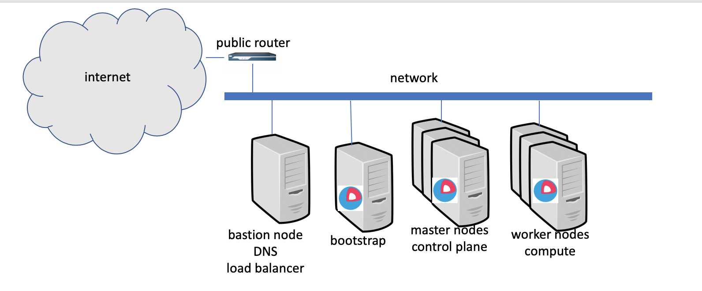

# terraform-openshift4-vmware-simple

Terraform to provision Openshift 4.x in VMware VMs using User Provided Infrastructure (UPI). This provisioning is using a minimal infrastructure on a flat network that is appropriate for testing or POC setup. The provisioning is focused on a bastion node that will have all the necessary tools to install and deploy the OpenShift installation. The deployment allows a variable number of master and worker nodes. You would need at least 1 each.

The bastion node would run Web server, bind DNS server and HA Proxy load balancer. The OpenShift 4 components are implemented from a RedHat Core OS image created from the OVA template. This template must be created before the terraform is run. 

## Architecture

Openshift 4.x using User-provided infrastructure



## Prerequisites 

1. RedHat CoreOS OVA is required, import into vSphere from [here](https://mirror.openshift.com/pub/openshift-v4/dependencies/rhcos/4.1/latest/rhcos-4.1.0-x86_64-vmware.ova).  Import into vSphere and converted to template.
2. A RHEL template used for bastion VM, and haproxy load-balancer.  These templates should have a valid subscription to RHEL.
3. Load the GIT repository of the terraform:

		git clone https://github.com/vbudi000/terraform-openshift4-vmware-simple
		cd terraform-openshift4-vmware-simple

3. Openshift pull secret, saved as a json file, from [here](https://cloud.redhat.com/openshift/install). It should be saved as `openshift_pull_secret.json` in the git repo path.

## OpenShift 4 installation flow using terraform

Openshift 4 has a unique bootstrap process where a bootstrap VM is initially created with a machine config server hosting the bootstrap ignition configurations for the rest of the cluster.  Our terraform procedure roughly works like:

1. bastion node created, which contain Web server (httpd), DNS server (bind) and Load Balancer (haproxy); all of these are configured and set to prepare for installation.
	- control plane load balancer created  forwarding traffic on port `6443` (Openshift API) and `22623` (machine config server) to the bootstrap and all control plane VMs
	- application load balancer created forwarding traffic on port `80` and `443`
	- DNS entries are created for each node (A and PTR records), and also DNS entries for the API server, etcd, and SRV records are created.
	- Installation and client code loaded in bastion
	- Base Ignition files are generated for each node type (bootstrap, master, and worker) and served through by the webserver.  These ignition files embed the initial TLS certs used to bootstrap kubelets into the Openshift cluster.

4. The bootstrap node is created, with an ignition file in the vApp properties that configures a static IP and hostname pointing at the bastion node to retrieve the rest of the cluster.  The bootstrap node starts the machine config server on port `22623`.
5. The control plane nodes are also created with static IPs and hostnames pointing at the bastion node to get the rest of the control plane ignition.  That ignition points it at the control plane load balancer on port `22623`, or the machine config server that the bootstrap node starts up.
The control plane receive their ignition files from the machine config server and start an etcd cluster.
7. The bootstrap nodes start up the Openshift API components through the etcd cluster started on the control plane nodes. The bootstrap node provisions the cluster version operator that provisions the rest of the components in the Openshift cluster. The bootstrap node exited its bootkube process and becomes idle.
9. The control plane  and worker nodes add themselves to the Openshift cluster and start up the Openshift API components.

## Terraform variables

Configuring the deployment is performed from the `terraform.tfvars` file. Copy the terraform.tfvars.example and customize that including to the following sections:

- OpenShift 4 deployment names and download token

```
name = "ocp41"
domain = "example.com"
openshift_pull_secret = "./openshift_pull_secret.json"
```

- vSphere resources

```
vsphere_server = "10.1.212.26"
vsphere_datacenter = "DC01"
vsphere_cluster = "Cluster01"
vsphere_resource_pool = "myVMpool"
network_label = "VMNetwork"
datastore_cluster = "DataStoreCluster"
folder = "/Sandbox/ocp41"
```

- vSphere templates information

```
rhcos_template = "Sandbox/templates/rhcos-4.1.0-x86_64-vmware"
rhel_template = "Sandbox/templates/RHEL7"
ssh_user = "root"
ssh_password = "templatepassword"
```

- Redhat subscribtion information

```
rhn_username = "me@example.com"
rhn_password = "PASSWORD"
rhn_poolid   = "abcdefabcdefabcdefabcdefabcdef01"
```

- DNS bind update access
```
dns_key_name = "ocp41.example.com."
dns_key_algorithm = "hmac-md5"
dns_key_secret = "mysecret"
```

- Network information
```
bastion_ip_address = "172.16.54.160"
bootstrap_ip_address = "172.16.54.171"
control_plane_ip_addresses = ["172.16.54.162" ]
worker_ip_addresses = ["172.16.54.165" ]
gateway = "172.16.255.250"
netmask = "16"
upstream_dns_servers = ["1.1.1.1"]
dns_ip_address = 172.16.54.160
```

- Cluster machines sizes
```
control_plane = {
    count = "1"
    vcpu = "8"
    memory = "16384"
}

worker = {
    count = "1"
    vcpu = "8"
    memory = "16384"
}

boot_disk = {
    disk_size = "200"
    thin_provisioned = "true"
    keep_disk_on_remove = false
    eagerly_scrub = false
}
```

## Running terraform deployment

To run the deployment (once the variables are configured), simply run the following commands:

- Initialize the plugins for terraform

		terraform init

- Export credentials to access vSphere

		export VSPHERE_USER=user
		export VSPHERE_PASSWORD=password

- Deploy to vSphere (took 30-60 minutes)

		terraform apply -auto-approve

- Clean up bootstrap node

		terraform apply --var 'bootstrap_complete=true' -auto-approve

#### Done


